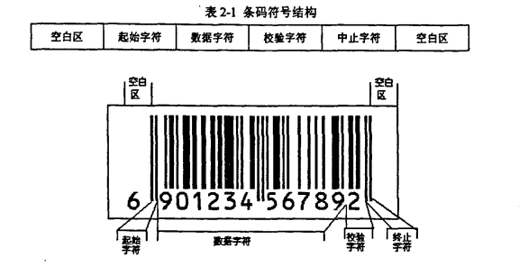
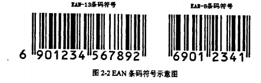
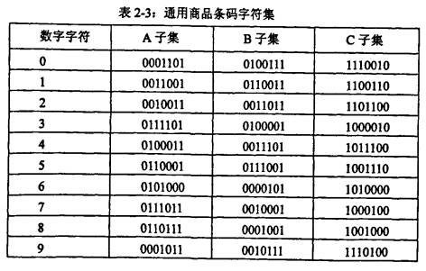
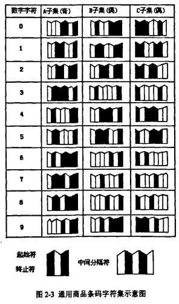
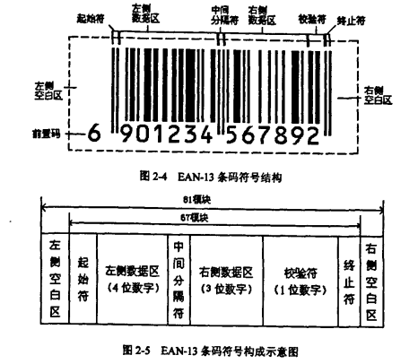
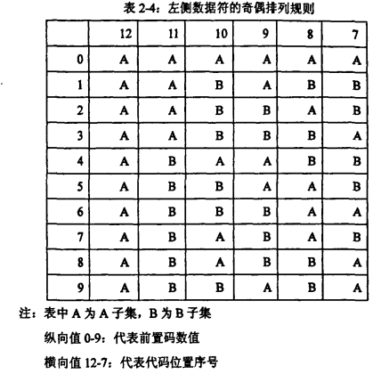
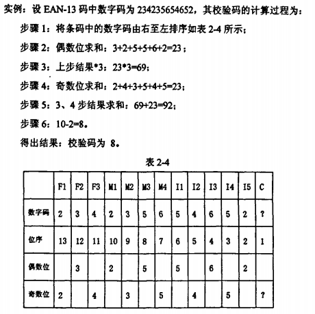
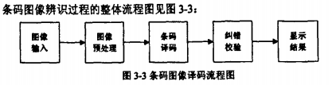
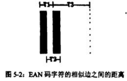

# 条形码[1]
## 组成
两侧空白区,起始符,数据字符,校验符



### EAN码
分为EAN-13和EAN-8，EAN由前缀码，厂商识别码，商品项目代码和校验码组成

## 编码方法
### 模块组合法
模块组合法是指条码符号中。条与空是由标准宽度的模块组合而成．**一个 标准宽度的条表示二进制的"1"，而一个标准宽度的空模块表示二进制的"0"**．

商品条码模块的 **标准宽度是0．33mm** ，它的一个字符由两个条和两个空构成，每 一个条或空由1--4个标准宽度模块组成．

### 宽度调节法
条与空的宽窄设置不同，用宽单元表示二进制的 1，而用窄单元表示二进制的0，宽窄单元之比一般控制在2-3．

### 特征
表示国际通用商品代码的条码符号称为通用商品条码符号．通用商品条码 (EAN)符号有两种版本，即13位标准码(又称为EAN-13码)和8位缩短码 (又称EAN-8码),它们都具有以下共同特征:
1. 四周都留有空白区
2. 条空分别由1-4个同一宽度的深或浅颜色的模块组成．深色模块用1
3. 表示，浅色模块0表示．
4. 在条码符号中。表示数字的每个条码字符 **仅由两个条和两个空** 组成，共7个模块．
5. 除了表示数字的条码字符外，还有一些辅助条码字符，用作表示起始、
6. 终止的分界符和平分条码符号的中间分割符．
7. 条码符号可设计成既可供固定式扫描器全向扫描，又可用手持扫描设备
8. 识读的形式．
9. 条码符号的大小可在放大系数的两个极限值所决定的尺寸之间变化。以
10. 适应不同印刷工艺的需求及用户对印刷面积的要求
11. 对一个特定大小的条码符号所规定的尺寸称为名义尺寸，放大系数的范微
12. 围0．8-2．0．
13. 供入识别的字符规定采用OCR-B字符．
14. 

### 字符集
EAN条码字符集包括1O个数字字符，即0-9．在条码符号中，每个数字字 符由七个模块的二进制表示，其表示形式见条码字符集中的A，B。C三个子集 (见下表) A子集中条码字符所包含的 **深色模块的个数为奇数** ，称为奇排列。B、C子 集中条码字符所包含的 **深色模块的个数为偶数**，称为偶排列。A、B子集的条码字符从左向右，以一个浅色 模块开始，以一个深色模块结束．C子集的条码字符从左向右，以一个深色模块 开始，以一个浅色模块结束。

 

### 具体格式
条形码的具体格式如下图


1. 左侧空白区最小宽度11bits，起始符7bits
2. 左侧数据区（不包括前置的6，前置码+厂商代码）有6位数字，按A子集或者B子集构成，42bits。
3. 中间分割符号由5bits构成
4. 右侧5位数字，35bits（商品代码），C子集
5. 校验符，7bits，C子集
6. 终止符3bits

前置码（上面图中的6）决定左侧数据的排列方式。见下表



校验码的计算：
1. 算上校验位，从右至左记为1-13
2. 从位置2开始，求出偶数和，记作a
3. 从位置3开始，求出奇数和，记作b
4. 校验位 = 10 - (a*3 + b) % 10

例子可参考下图



# 识别[1]
## 论文 _[1]_ 中的基本思想


## 图像分割算法（提取）
### 按三种情况分类：
- 按照原理（本质上是按照图片内部具有一定均匀的特性来进行图片分割）
  1. 阈值分割
  2. 边缘检测
  3. 区域提取（合并-分裂算法）

- 处理策略 （串行/并行）
- 按照知识
  1. 面向特征
  2. 以统计机理为中心的构造
  3. 针对图像对象的信号表示
  4. 数据融合的多信息源集成
  5. 特定领域系统

### 基本算法
#### 灰度图阈值法
确定阈值的方法：P-参数法，模式法，最大方差比的阈值方法。 可能会用到神经网络，模糊数学，遗传算法等  

#### 边缘检测
利用不同区域间性质发生突变的现象产生，形成明显边界，可以通过求导数的方法获得边缘的大致范围。  然后求二阶导数，零点为边界。  将微分化为差分之后，可以借助一些算子来进行卷积。

  常见的算子有Roberts， Prewitt, Sobel

### 条码图像分割与二值化处理
> 关于图像分割的实现可以参考下面的通过python与opencv定位条码

论文中提到的分割方法为瓦楞纸箱直接去除背景后所得。  

关于这种做法的可行性需要进一步讨论

#### 灰度处理
1. 256色转灰度：$Y=0.299R+0.587G+0.114B$
2. 灰度直方图(Histogram)
3. 阈值变换（二值化）中，阈值需要反复测试，期望能自适应

### 滤波
滤波的作用是去除噪声的干扰 滤波个人理解就是把一个小窗口套入到图像矩阵的点上，根据小窗口内的点来得到矩阵中间的点

#### 中值滤波
原理：用一个滑动窗口，取得窗口中的点排序后点的中位数作为滤波器的输出

#### 形态滤波
利用Mathematical Morphology进行识别
1. 腐蚀
2. 膨胀
3. 开启（腐蚀+膨胀）
4. 闭合（膨胀+腐蚀）

### 图像矫正
直线探测：Hough变换（探测直线或者圆），用于获取条形码倾斜的角度

## 译码
### EAN-13特性：
每个（整体的）条与空的宽度不超过4条，且和为7

根据每一个连续的条空宽度（条表示1，空表示0）则可得到译码后的数字

### 译码方案
1. 宽度测量
2. 平均值
3. 相似边距离的测量

前两种方法对图像要求非常高（？），第三种大概如下：



设整个字符长度为$L$，于是$L=T_1+T_3$，平均单位元素宽度$l=\frac{L}{7}$

于是$T_1, T_2, T_3$的单位元素宽度分别为

$\frac{7T_1}{L}, \frac{7T_2}{L}, \frac{7T_3}{L}$

这三个参数与EAN的逻辑值一一对应（1，7，2，8）除外。需要时可单独计算

由于EAN-13对应图像的每一行都有确定的变化点，所以可以对图像进行逐行扫描，抛弃掉不等于这些确定变化点的值。

关于译码如何归一化，具体可参考论文[1]，比较trivial

**在实现过程中可能会遇到的问题**

> 二值化自适应能否做到？

> 图像分割算法需要进一步讨论

> 译码方案3的稳定性不清楚，是否还有更好的替代方案？

> 关于条码在我们的方案中的可行性问题需要讨论，论文[1]中提到的条码识别很大程度依赖于条码的宽度的准确性 当图片太远的时候,若采集的图像精度不够高,条码的判断会变得比较困难.

# 通过PYTHON与OPENCV定位条形码[2]
## 配置程序环境
> 尽量在LINUX下配置环境吧，这样让事情更加简单

### Python
尽量使用python2.7的版本（在Terminal中使用`python --version`查看）

### OpenCV
在终端运行下列命令：  

```
sudo apt-get install python-opencv
```

然后在python中尝试运行`import cv2;`如果没有提示错误,说明成功

_目前此opencv的版本号尚不清楚，需要再查资料，但是这个软件包可以使用cv2这个库。_

_网上的一些代码目前这样的配置在我的_`Ubuntu 14.04/Python 2.7.6`_是可以运行的_

### NumPy [3]
在终端运行下列命令：  

```
sudo add-apt-repository ppa:scipy/ppa
sudo apt-get update
sudo apt-get install python-numpy
```

然后在python中尝试运行`import numpy;`如果没有提示错误,说明成功

## 具体实现细节
# 参考文献
[1] [基于数字图像处理方式的EAN-13条码识读算法研究](http://d.wanfangdata.com.cn/Thesis_Y971287.aspx)

[2] [用Python和OpenCV检测图片上的条形码](http://blog.jobbole.com/80448/)

[3] [PPA for SciPy](https://launchpad.net/~scipy/+archive/ubuntu/ppa)
